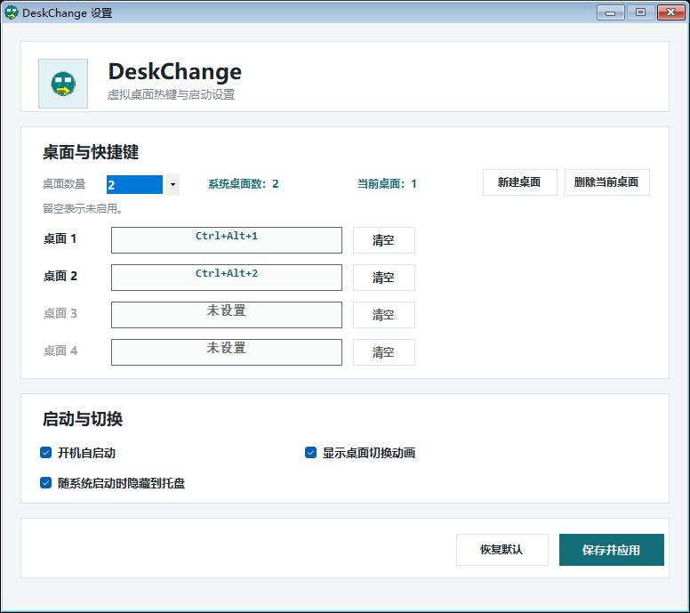
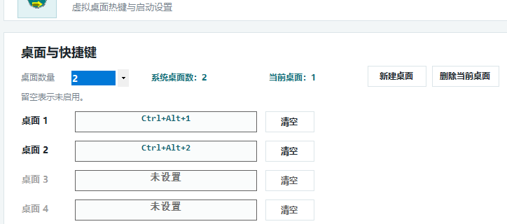

# DeskChange

> A portable Windows 11 virtual desktop manager with a compact Chinese settings UI.

DeskChange 是一个面向 Windows 11 的虚拟桌面管理工具。它不替代 Windows 自带的虚拟桌面系统，而是在系统现有能力之上补齐更实用的日常操作：可配置快捷键、桌面新建与删除、开机自启，以及切换动画控制。

DeskChange is a lightweight Windows 11 utility built on top of the native virtual desktop system. It adds practical controls that Windows does not expose in one place, including configurable hotkeys for desktops 1-4, desktop creation and deletion, startup options, and switch animation toggles.


## 项目截图

主界面



桌面与快捷键配置



启动与切换设置


## 功能特性

- 支持 1 到 4 个虚拟桌面的快捷键独立配置
- 支持在主界面直接新建桌面、删除当前桌面
- 支持开启或关闭桌面切换动画
- 支持开机自启动
- 支持随系统启动后隐藏到托盘
- 关闭主窗口时自动收起到托盘，托盘菜单保持极简
- 同时提供安装版和便携版

## 解决的问题

Windows 自带虚拟桌面很好用，但默认交互更偏系统级，而不是高频效率工具。DeskChange 主要补的是下面这些空缺：

- 原生快捷键不方便直接跳到指定桌面
- 想保留 Windows 原生虚拟桌面，而不是引入另一套桌面管理器
- 想把创建、删除、热键、动画、自启动放到一个统一的轻量界面里
- 想要一个可以直接拷走使用的便携工具，或者一个标准安装包

## 下载

最新版本在 Releases 页面：

- 安装版：`DeskChange-Setup.exe`
- 便携版：`DeskChange-portable.zip`

下载地址：

- [Latest Release](https://github.com/wydyxhxs/deskchange/releases/latest)
- [v1.0.2](https://github.com/wydyxhxs/deskchange/releases/tag/v1.0.2)

## 使用方式

1. 下载并启动安装版，或解压便携版后运行 `DeskChange.exe`
2. 在主界面选择要启用的桌面数量
3. 为每个桌面设置快捷键
4. 需要时打开“开机自启动”或“显示桌面切换动画”
5. 点击“保存并应用”

补充说明：

- 当配置的桌面数量大于系统当前真实桌面数时，超出的热键不会立即生效
- 可以直接在主界面点击“新建桌面”补齐数量
- 删除操作针对当前桌面，并带确认提示
- 关闭窗口不会退出程序，而是隐藏到托盘

## 安装版与便携版

安装版适合长期使用：

- 提供标准安装向导
- 更适合普通用户部署

便携版适合直接拷走使用：

- 解压即可运行
- 配置保存在程序目录下的 `DeskChange.settings.ini`

## 运行环境

- Windows 11
- .NET Framework 4.8

## 技术实现

- 主界面使用 WinForms 构建
- 应用本身负责设置管理、热键注册、托盘生命周期和桌面操作入口
- 实际虚拟桌面操作通过打包的 `VirtualDesktopHelper.exe` 完成
- 该 helper 来自 Markus Scholtes 的开源项目，许可证见 [vendor/LICENSE.MScholtes.txt](vendor/LICENSE.MScholtes.txt)

## 构建

在项目根目录执行：

```powershell
powershell -ExecutionPolicy Bypass -File .\build.ps1
```

构建产物输出到 `artifacts/`：

- `artifacts/Release/DeskChange.exe`
- `artifacts/DeskChange-Setup.exe`
- `artifacts/DeskChange-portable.zip`

## 仓库结构

- `src/`：主程序源码
- `setup/`：安装向导源码
- `installer/`：安装/卸载脚本
- `vendor/`：第三方 helper 及许可证
- `tools/`：构建与素材生成脚本
- `docs/screenshots/`：README 截图资源
